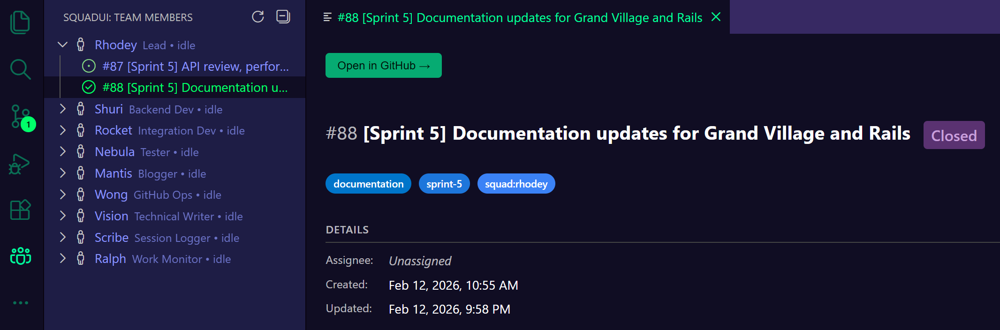

# SquadUI

[](https://github.com/csharpfritz/SquadUI/actions/workflows/ci.yml)
[](https://github.com/csharpfritz/SquadUI/actions/workflows/release.yml)
[](https://marketplace.visualstudio.com/items?itemName=csharpfritz.squadui)
[](https://marketplace.visualstudio.com/items?itemName=csharpfritz.squadui)
[](https://marketplace.visualstudio.com/items?itemName=csharpfritz.squadui)
[](LICENSE)

Visualize Squad AI team members and their tasks directly in VS Code.



## Features

- **Team member tree view** — see every Squad agent, their role, and current status at a glance
- **Issue tracking** — open and closed GitHub issues assigned to each team member appear inline
- **Issue detail panel** — click any issue to view details with a direct link to open in GitHub
- **Squad AI integration** — reads your `.ai-team/team.md` roster and GitHub issues automatically

## Getting Started

1. Install the extension from the [VS Code Marketplace](https://marketplace.visualstudio.com/items?itemName=csharpfritz.squadui)
2. Open a repository that has a `.ai-team/team.md` file (or any repo with a Squad AI team configured)
3. Look for the **SquadUI: Team Members** view in the sidebar

## Development

```bash
npm install
npm run compile
```

Press F5 to launch the Extension Development Host.

## License

See [LICENSE](LICENSE) for details.
